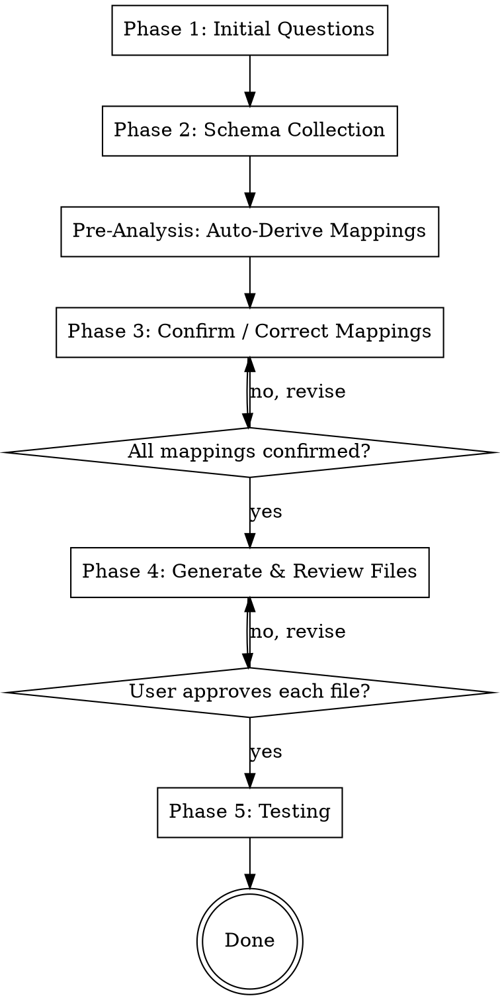

# Scaffold Snowflake Connector

## Overview

This skill scaffolds all code required to add a new snowflake-connector data source to crowd.dev. It covers up to 11 touch points, enforces zero-assumption practices, and requires explicit user validation for every piece of business logic before writing any file to disk.

**One platform, one source per run.** Multiple sources within a platform are done one run at a time.

## Process Flow



## File Inventory (All Touch Points)

Read the current state of each file before modifying. Never modify without reading first.

### Conditional — only if platform is NEW
| # | File | Change |
|---|------|--------|
| 0 | `services/libs/types/src/enums/platforms.ts` | Add `PlatformType.{PLATFORM}` enum value |

### Always — structural (template-filled)
| # | File | Change |
|---|------|--------|
| 1 | `services/libs/types/src/enums/organizations.ts` | Add to `OrganizationSource` + `OrganizationAttributeSource` enums |
| 2 | `services/libs/integrations/src/integrations/{platform}/types.ts` | NEW: activity type enum + GRID |
| 3 | `services/libs/integrations/src/integrations/index.ts` | Add `export * from './{platform}/types'` |
| 4 | `services/libs/data-access-layer/src/organizations/attributesConfig.ts` | Add to `ORG_DB_ATTRIBUTE_SOURCE_PRIORITY` |
| 5 | `backend/src/database/migrations/V{epoch}__add{Platform}ActivityTypes.sql` | NEW: INSERT into `activityTypes` |
| 6 | `services/apps/snowflake_connectors/src/integrations/types.ts` | Add `DataSourceName.{PLATFORM}_{SOURCE}` |
| 7 | `services/apps/snowflake_connectors/src/integrations/index.ts` | Import + register in `supported` |

### Per source — business logic (generated from confirmed inputs)
| # | File | Change |
|---|------|--------|
| 8 | `services/apps/snowflake_connectors/src/integrations/{platform}/{source}/buildSourceQuery.ts` | NEW |
| 9 | `services/apps/snowflake_connectors/src/integrations/{platform}/{source}/transformer.ts` | NEW |
| 10 | `services/apps/snowflake_connectors/src/integrations/{platform}/{platform}TransformerBase.ts` | NEW (optional) |

---

## Context Detection

Run this **once at skill start**, before any other step.

Check whether the skill is running inside the crowd.dev repository by testing for the presence of the snowflake connectors integration index:

```
services/apps/snowflake_connectors/src/integrations/index.ts
```

Use `Glob` or `Read` to check for this file relative to the current working directory.

### Case A — File found (running inside crowd.dev)

Set `CROWD_DEV_ROOT = "."` (current directory). All file paths in this skill are relative to CWD. Proceed to Phase 1 immediately.

### Case B — File not found (running from cross-team skills repo or elsewhere)

Ask the user:
> "This skill needs access to the crowd.dev repository to read and modify files. Do you have a local clone?
> - If yes: provide the absolute path (e.g., `/Users/you/work/crowd.dev`)
> - If no: I'll give you the clone command first."

If the user provides a path: verify it by checking `{path}/services/apps/snowflake_connectors/src/integrations/index.ts` exists. If confirmed, set `CROWD_DEV_ROOT = {path}`. Proceed to Phase 1.

If the path doesn't exist or they need to clone:
> "Run: `git clone https://github.com/linuxfoundation/crowd.dev.git`
> Then provide the path to the cloned directory."

Wait for a valid path before continuing.

**For all subsequent file operations**, prefix every path in this skill with `CROWD_DEV_ROOT`. Example: `services/libs/types/src/enums/platforms.ts` becomes `{CROWD_DEV_ROOT}/services/libs/types/src/enums/platforms.ts`.

---

## Phase 1: Initial Questions

Ask one question at a time. Do not bundle questions.

### Question 1 — Platform name

Read `services/libs/types/src/enums/platforms.ts` and list all current `PlatformType` values.

Ask:
> "What is the platform name for this data source? It must match a `PlatformType` enum value. Current values are: [list them]. If your platform isn't listed, provide the name and I'll add it."

- If the value **is** in the enum: continue.
- If the value **is not** in the enum: warn the user explicitly:
  > "⚠️ `{name}` is not in the `PlatformType` enum. I'll need to add it to `services/libs/types/src/enums/platforms.ts`. Please confirm this is a new platform and confirm the exact string value (e.g., `my-platform`)."
  Wait for confirmation before proceeding.

### Question 2 — New or existing platform?

Read `services/apps/snowflake_connectors/src/integrations/index.ts`.

- If the platform already has sources registered: list them and confirm which one we're adding.
- If the platform is new to snowflake_connectors: note that touch points 0–4 and 7 will all be new additions.

### Question 3 — Source name

Ask:
> "What is the name for this data source? This becomes the directory name and `DataSourceName` enum suffix (e.g., `enrollments`, `event-registrations`)."

### Question 4 — Snowflake tables

Ask for the main table first, then any additional tables:
> "What is the main Snowflake table for this source?"

Then:
> "Are there any additional tables needed (e.g., for user data, org data, segment matching)? For each one, provide the table name and its purpose — what data it holds and how it relates to the main table."

Do not assume a direct JOIN between tables. The relation type (JOIN, subquery, CTE, lookup) must come from the user's description of each table's purpose.

---

## Phase 2: Schema Collection

Once all table names are known, collect column schemas using the LFX BI Layer MCP tools. Only fall back to the manual query when BI Layer lookup fails for a specific table.

### Step 0 — Check BI Layer connectivity

Use `ToolSearch` with query `"LFX BI Layer get_all_sources"` to check whether the BI Layer tools are available in the current session.

- **Tools found**: proceed directly to Step 1.
- **Tools not found**: prompt the user to authenticate:
  > "The LFX BI Layer MCP is not connected. To enable automatic schema lookup, run `/mcp` and select **'claude.ai LFX BI Layer'** to authenticate. Once done, say 'continue' and I'll proceed. Or say 'skip' to use the manual query approach instead."

  Wait for the user's response. If they authenticate: re-check with `ToolSearch` and proceed to Step 1. If they skip or authentication still fails: proceed directly to Step 2 for all tables.

### Step 1 — BI Layer lookup (always attempt first)

1. Call `mcp__claude_ai_LFX_BI_Layer__get_all_sources`. This returns all registered dbt sources.
2. For each user-provided table, search the results (case-insensitive match on the `name` field).
3. For each table **found**: call `mcp__claude_ai_LFX_BI_Layer__get_source_details` using the `uniqueId` from Step 1. Extract the column registry from `catalog.columns`: each entry has `name`, `type`, and `index` (ordinal position).
4. For each table **not found** in dbt sources: inform the user and fall back to Step 2 for that table only.

### Step 2 — Manual fallback (only for tables not in dbt sources)

Generate the ACCOUNT_USAGE query for the missing tables and ask the user to run it:

```sql
SELECT DISTINCT
  table_catalog,
  table_schema,
  table_name,
  column_name,
  data_type,
  is_nullable,
  ordinal_position
FROM SNOWFLAKE.ACCOUNT_USAGE.COLUMNS
WHERE (table_catalog, table_schema, table_name) IN (
  ('DB1', 'SCHEMA1', 'TABLE1')
  -- one row per missing table
)
AND DELETED IS NULL
ORDER BY table_name, ordinal_position;
```

Ask the user to paste the output or provide a path to an exported file (CSV, JSON, or TSV). If a file path is given, read the file.

### Column registry

After Step 1 and/or Step 2, build a column registry per table:
- Column name (exact casing from schema — this is the reference for all code)
- Data type
- Ordinal position

**Store this as the canonical column reference. Every column name used in generated code must appear in this registry. Never assume or invent a column name.**

**Flag non-VARCHAR column types** (e.g., `DATE`, `TIME`, `TIMESTAMP_TZ`, `BOOLEAN`, `NUMBER`) — these arrive as native JS types from the Parquet reader, not strings (see touch point 9 rules).

For each JOIN table, check whether any existing transformer in `services/apps/snowflake_connectors/src/integrations/` queries from the same table. If yes, inherit its column mappings; if no, treat every column as unknown and derive it from sample data in the Pre-Analysis step below.

### Step 3 — Sample data

Attempt to retrieve sample data via the LFX BI Layer before asking the user to run a manual query.

#### Option A — query_metrics (attempt first)

1. Call `mcp__claude_ai_LFX_BI_Layer__list_metrics`. Search the results for metrics whose name or description relates to the platform/source (e.g., `total_committees`, `total_committee_members`, `total_enrollments`).
2. For each relevant metric found, call `mcp__claude_ai_LFX_BI_Layer__get_dimensions` to list available dimensions.
3. Select all categorical dimensions that are likely to correspond to identity, org, or activity fields (email, username, name, status, type, date, project_slug, etc.).
4. Call `mcp__claude_ai_LFX_BI_Layer__query_metrics` with those dimensions and `limit: 20`.
5. Use the returned rows as sample data for Pre-Analysis.

**Important caveat:** `query_metrics` queries semantic/transformed dbt models, not raw source tables. Column names in the result come from the semantic model and may differ from raw schema column names. Use the data to infer field roles and value patterns; map back to raw column names using the schema registry from Step 1–2.

If no relevant metrics are found, or the returned dimensions don't cover the fields needed for mapping, fall through to Option B.

#### Option B — manual paste (fallback)

Generate a sample data query using **only explicit column names from the registry** (never `*`) and ask the user to run it in Snowflake:

```sql
SELECT
  main.col1, main.col2, main.col3,  -- all columns from main table registry
  j1.col1, j1.col2,                  -- all columns from each JOIN table
  ...
FROM DB.SCHEMA.MAIN_TABLE main
LEFT JOIN DB.SCHEMA.JOIN_TABLE1 j1 ON main.join_key = j1.pk
-- ... all joins
LIMIT 20;
```

Ask the user:
> "Please run this query in Snowflake and paste the result or provide a path to the exported file (CSV, JSON, or TSV). I'll use the actual data values to auto-derive column mappings before asking for your confirmation."

---

## Pre-Analysis: Auto-Derive Mappings

Before asking the user any Phase 3 questions, perform this analysis using the schema registry, the pasted sample data, and existing implementations that query the same tables.

### Step 1 — Inherit from existing implementations

For each JOIN table, check if any existing transformer imports or queries from it. If found, inherit those column mappings directly — they are already validated.

Read the relevant transformer files from `services/apps/snowflake_connectors/src/integrations/` and extract: which column maps to email, username, LFID, org name, org website, domain aliases, timestamp, sourceId.

### Step 2 — Infer remaining roles from names + data values

For columns not covered by an existing implementation, apply these heuristics:

| Role | High-confidence signals |
|------|------------------------|
| Email | Name contains `EMAIL`; values match `x@y.z` pattern |
| Platform username | Name is `USER_NAME`, `USERNAME`, `LOGIN`, `HANDLE`; values are non-email strings |
| LFID | Name contains `LF_USERNAME`, `LFID`, `LF_ID` |
| Timestamp (incremental) | Type is TIMESTAMP; name contains `UPDATED`, `MODIFIED`; nullable=NO |
| sourceId | Name ends in `_ID`; values appear unique in sample |
| Org name | Name contains `ACCOUNT_NAME`, `ORGANIZATION_NAME`, `COMPANY` |
| Org website | Name contains `WEBSITE`, `DOMAIN`, `URL`; values start with `http` |
| Domain aliases | Name contains `DOMAIN_ALIASES`, `ALIASES`; values are comma-separated or array |

Assign each role a confidence level:
- **HIGH** — column name + data values both match unambiguously
- **MEDIUM** — multiple candidates exist, or name matches but data is ambiguous
- **LOW / UNKNOWN** — no clear match

### Step 3 — Present consolidated proposal

Present all HIGH-confidence mappings at once (exception to the one-question-per-message rule — batching is intentional here for efficiency). For MEDIUM, offer choices. For LOW/UNKNOWN, ask open-ended:

> "Based on the schema and sample data, here's what I identified:
> - **Email**: `USER_EMAIL` (contains email values like `user@example.com`) ✅
> - **Username**: `USER_NAME` ✅
> - **LFID**: `LF_USERNAME` ✅
> - **Timestamp**: `UPDATED_TS` (TIMESTAMP_NTZ, not nullable) ✅
> - **sourceId**: `REGISTRATION_ID` (appears unique in sample) ✅
> - **Org website**: `ORG_WEBSITE` ✅
> - **Org name**: `ACCOUNT_NAME` or `COMPANY_NAME`? (both present)
> - **Domain aliases format**: couldn't determine — comma-separated string or array?
>
> Please confirm the ✅ items and resolve the open questions."

After the user responds, record all confirmed mappings. **Skip any Phase 3 sub-step whose mappings are fully resolved here.** Only enter a sub-step for fields that remain MEDIUM, LOW, or flagged by the user.

---

## Phase 3: Confirm / Correct Mappings

**Rule:** Skip sub-sections where Pre-Analysis fully resolved the mapping. For remaining sub-sections, use the propose-then-confirm pattern — never ask open-ended questions when a proposal can be made. Present choices when multiple candidates exist. Ask open-ended only when no inference is possible.

**When raising any ambiguity, always include:**
1. **How existing data sources handle it** — read the relevant transformer(s) from `services/apps/snowflake_connectors/src/integrations/` and show the pattern. If an existing source skips or doesn't implement the feature, say so explicitly (e.g., "TNC doesn't use a logo field — it's left undefined").
2. **A Snowflake query to resolve it** — if the ambiguity can be answered by inspecting actual data (e.g., checking uniqueness, null rate, value distribution), provide the query so the user can run it instead of guessing.

When raising any ambiguity that can be resolved by inspecting data, first try `mcp__claude_ai_LFX_BI_Layer__query_metrics` with the relevant dimensions and a `where` filter to narrow results. Only ask the user to run a manual Snowflake query if the semantic layer doesn't have dimensions covering the ambiguous columns.

Example format for an ambiguity:
> "I see two timestamp columns: `CREATED_AT` (nullable) and `UPDATED_AT` (not nullable).
> - Existing sources (TNC, CVENT) all use a non-nullable `updated_ts`-style column for incremental exports.
> - To check null rates, run:
>   ```sql
>   SELECT COUNT(*) total, COUNT(CREATED_AT) created_not_null, COUNT(UPDATED_AT) updated_not_null FROM DB.SCHEMA.TABLE LIMIT 10000;
>   ```
> Which column should be used as the incremental timestamp?"

---

### 3a. Identity Mapping

**Rule:** Every member record must produce at least one identity with `type: MemberIdentityType.USERNAME`. The standard approach is to use the unified `buildMemberIdentities()` method on `TransformerBase` (added in the identity deduplication refactor). Only fall back to inline identity construction if the user explicitly requests it and can justify why the unified method cannot be used (e.g., fundamentally different identity shape not covered by the method's logic).

The unified method covers the standard fallback chain automatically. Full behavior by case:

| `platformUsername` | `lfUsername` | Identities produced |
|---|---|---|
| null | null | EMAIL(platform) + USERNAME(platform, email) |
| set | null | EMAIL(platform) + USERNAME(platform, platformUsername) |
| null | set | EMAIL(platform) + USERNAME(LFID, lfUsername) + USERNAME(platform, lfUsername) |
| set | set | EMAIL(platform) + USERNAME(platform, platformUsername) + USERNAME(LFID, lfUsername) |

**Critical:** Never pass `lfUsername` as `platformUsername`. When a source only has an LFID column (no platform-native username), pass `platformUsername: null` — the lfUsername-only path (row 3 above) already produces the correct USERNAME identity for the platform using the lfUsername value.

If Pre-Analysis resolved email, platformUsername, and LFID columns with HIGH confidence and the user confirmed them, skip to the summary step below.

For any unresolved identity field, use this pattern:
- **Multiple candidates found**: "I see columns `A` and `B` that could be the email — which one?" (present choices, not open-ended)
- **One candidate found**: "I believe `USER_EMAIL` is the email column based on its values. Confirm?" (one-tap confirmation)
- **No candidate found**: "I couldn't identify an email column — please specify."

For each confirmed identity column also confirm:
- `verified: true`? (default yes — ask only if the data suggests otherwise)
- `verifiedBy` value (default: platform type — propose it, don't ask open-ended)

**Critical:** If a JOIN table for users is NOT the same table used by an existing implementation, validate every column explicitly regardless of Pre-Analysis confidence. Column name heuristics alone are not sufficient for unknown tables.

After all identity fields are confirmed, summarize how `buildMemberIdentities()` will be called and ask:
> "Here is how identities will be built:
> `this.buildMemberIdentities({ email, sourceId: [col or null], platformUsername: [col or null], lfUsername: [col or null] })`
> Does this look correct?"

---

### 3b. Organization Mapping

If Pre-Analysis determined there is no org data (no org-related columns found in any table): before asking the user, first read existing transformers in `services/apps/snowflake_connectors/src/integrations/` to check whether any of them join an org table using a key that also exists in the user's tables. If a match is found, prompt the user:
> "I don't see org columns in the tables you provided, but [EXISTING_PLATFORM] sources org data from `{ORG_TABLE}` via `{join_key}` — which also appears in your table. Did you mean to include this? (Recommended)"

If no existing pattern is joinable, ask: "I don't see any org columns. Does this source have org/company data?" — if yes, ask for the table; if no, skip to 3c.

If Pre-Analysis identified org columns:

- If sourced from a JOIN table already used by an existing implementation: read that transformer's `buildOrganizations` method and show the user exactly which columns will be used. Ask: "The org mapping follows the existing [PLATFORM] implementation — does this look correct?"
- If new org table: present the Pre-Analysis proposals for each field, one at a time:
  - "Org name: I see `ACCOUNT_NAME` (values like `Acme Corp`). Confirm, or specify another column."
  - "Website: I see `ORG_WEBSITE` (values start with `http`). Confirm?"
  - "Domain aliases: I see `DOMAIN_ALIASES` — are these comma-separated strings or an array?"
  - "Logo URL: I see `LOGO_URL`. Confirm, or is there no logo column?"
  - "Industry: I see `ORGANIZATION_INDUSTRY`. Confirm?"
  - "Size: I see `ORGANIZATION_SIZE`. Confirm?"

**Critical — `isIndividualNoAccount`:**
Read `services/apps/snowflake_connectors/src/core/transformerBase.ts` to find `isIndividualNoAccount`. The generated code MUST call this method rather than reimplementing it. Show the user the method signature and confirm it will be used identically to existing sources.

After all org columns are confirmed, summarize and ask for confirmation before proceeding.

---

### 3c. Activity Types

**Rule:** Activity type names and scores come entirely from the user. Do not suggest them.

Ask:
> "Please list all activity types this source can produce. For each, provide:
> - A short name (e.g., `enrolled-certification`)
> - A score from 1–10
>
> I'll suggest the enum key, label, description, and flags for each one."

For each activity type the user provides, suggest the following **one at a time**, waiting for approval before moving to the next:

| Field | Suggestion rule |
|-------|----------------|
| Enum key | SCREAMING_SNAKE_CASE version of the name (e.g., `ENROLLED_CERTIFICATION`) |
| String value | The name the user provided (kebab-case) |
| Label | Human-readable (e.g., `Enrolled in certification`) |
| Description | One sentence describing the event (follow the style in `backend/src/database/migrations/V1771497876__addCventActivityTypes.sql` and `V1772556158__addTncActivityTypes.sql`) |
| `isCodeContribution` | `false` unless it involves code (check existing platforms — almost always false for non-GitHub sources) |
| `isCollaboration` | `false` unless it is a collaborative activity |

Ask: "Does this look correct for `{type_name}`? Any changes?" before moving to the next type.

---

### 3d. Timestamp & sourceId

If Pre-Analysis already proposed these with HIGH confidence, present them with this explanation before asking for confirmation (never skip the explanation — it ensures the user understands the criticality):

> "The **timestamp column** drives all incremental exports — records updated after the last export run are re-fetched using this column. It must never be null. The **sourceId** is the deduplication key — two records with the same sourceId produce only one activity. It must uniquely identify each logical event."

Then confirm the Pre-Analysis proposals:

1. Timestamp: "I identified `UPDATED_TS` (TIMESTAMP_NTZ, not nullable) as the incremental timestamp. Confirm?"
   - If the proposed column is nullable=Y: "⚠️ `UPDATED_TS` is marked nullable in the schema. Can it actually be null in practice? If yes, we need an alternative or a `WHERE col IS NOT NULL` guard." Wait for resolution.
   - If no candidate was found: "I couldn't identify an update timestamp column — please specify. Valid examples: `updated_ts`, `enrolled_at`, `created_at`."

2. sourceId: "I identified `REGISTRATION_ID` as the sourceId (appears unique in sample). Confirm, and is this guaranteed unique per logical event (not just per user)?"
   - If no candidate was found: "I couldn't identify a unique record ID — please specify which column to use as `sourceId`."

---

### 3e. Base Class Check

- If this is the **first and only source** for this platform: no base class — `transformer.ts` extends `TransformerBase` directly and contains all logic inline (CVENT pattern). Do not propose a base class.

- If the platform **will have multiple sources** (user confirmed more sources are planned or already exist):
  - Check if `services/apps/snowflake_connectors/src/integrations/{platform}/{platform}TransformerBase.ts` exists.
  - If yes: new transformer extends it. Confirm with user.
  - If no and shared org logic exists: propose creating the base class. Show proposed structure (modeled on `tncTransformerBase.ts`). Ask for confirmation before creating.

---

### 3f. Project Slug for Testing

Ask:
> "Please provide a `project_slug` from CDP_MATCHED_SEGMENTS that has data in this Snowflake table. It should have a moderate number of records (ideally under a few thousand) and ideally cover all the activity types we're implementing. This slug will be used to restrict the test query and for the staging non-prod guard in `buildSourceQuery`."

---

## Phase 4: File Generation & Review

Before generating any files, ask the user:
> "How would you like me to proceed with the implementation?
> - **A — Review mode:** I show each file before writing it, you approve or request changes.
> - **B — Auto mode:** I implement all files directly, then show a summary of everything written for a final review."

Proceed based on the user's choice. Read each target file before modifying it in both modes.

---

### Structural Files (touch points 0–7)

These are template-filled from confirmed inputs. No business logic reasoning required.

**Touch point 0 — `platforms.ts`** (only if new platform)

Add `{PLATFORM} = '{platform-string}',` to the `PlatformType` enum in alphabetical order among the non-standard entries.

---

**Touch point 1 — `organizations.ts`**

File: `services/libs/types/src/enums/organizations.ts`

Add to both enums:
- `OrganizationSource.{PLATFORM} = '{platform-string}'`
- `OrganizationAttributeSource.{PLATFORM} = '{platform-string}'`

---

**Touch point 2 — `{platform}/types.ts`** (new file)

File: `services/libs/integrations/src/integrations/{platform}/types.ts`

Template (fill with confirmed activity types and scores):

```typescript
import { IActivityScoringGrid } from '@crowd/types'

export enum {Platform}ActivityType {
  {ENUM_KEY} = '{string-value}',
  // ... one entry per confirmed activity type
}

export const {PLATFORM}_GRID: Record<{Platform}ActivityType, IActivityScoringGrid> = {
  [{Platform}ActivityType.{ENUM_KEY}]: { score: {score} },
  // ... one entry per confirmed activity type
}
```

---

**Touch point 3 — `integrations/index.ts`**

File: `services/libs/integrations/src/integrations/index.ts`

Add before `export * from './activityDisplayService'`:
```typescript
export * from './{platform}/types'
```

---

**Touch point 4 — `attributesConfig.ts`**

File: `services/libs/data-access-layer/src/organizations/attributesConfig.ts`

Add `OrganizationAttributeSource.{PLATFORM},` to the `ORG_DB_ATTRIBUTE_SOURCE_PRIORITY` array, positioned after the most recently added snowflake platform (currently after `OrganizationAttributeSource.TNC`).

---

**Touch point 5 — Flyway migration** (two new files)

Use a 10-digit second-epoch for the timestamp — run `date +%s` in terminal.

**File A:** `backend/src/database/migrations/V{epoch_seconds}__add{Platform}ActivityTypes.sql`

```sql
INSERT INTO "activityTypes" ("activityType", platform, "isCodeContribution", "isCollaboration", description, "label") VALUES
('{string-value}', '{platform-string}', {false|true}, {false|true}, '{description}', '{label}'),
-- ... one row per confirmed activity type, last row without trailing comma
('{string-value}', '{platform-string}', {false|true}, {false|true}, '{description}', '{label}');
```

**File B:** `backend/src/database/migrations/U{epoch_seconds}__add{Platform}ActivityTypes.sql`

Empty file — same timestamp and name as File A, prefix `U` instead of `V`. Matches the pattern used by existing migrations (e.g., `U1771497876__addCventActivityTypes.sql`).

---

**Touch point 6 — `snowflake_connectors/types.ts`**

File: `services/apps/snowflake_connectors/src/integrations/types.ts`

Add to `DataSourceName` enum:
```typescript
{PLATFORM}_{SOURCE} = '{source-name}',
```

---

**Touch point 7 — `snowflake_connectors/index.ts`**

File: `services/apps/snowflake_connectors/src/integrations/index.ts`

Add import at top:
```typescript
import { buildSourceQuery as {platform}{Source}BuildQuery } from './{platform}/{source}/buildSourceQuery'
import { {Platform}{Source}Transformer } from './{platform}/{source}/transformer'
```

Add to `supported` object under the platform key (create the key if new platform):
```typescript
[PlatformType.{PLATFORM}]: {
  sources: [
    {
      name: DataSourceName.{PLATFORM}_{SOURCE},
      buildSourceQuery: {platform}{Source}BuildQuery,
      transformer: new {Platform}{Source}Transformer(),
    },
  ],
},
```

If the platform already exists, append to its `sources` array instead of creating a new key.

---

### Business Logic Files (touch points 8–10)

These are AI-generated from the confirmed column mappings. Apply all rules strictly.

---

**Touch point 8 — `buildSourceQuery.ts`** (new file)

File: `services/apps/snowflake_connectors/src/integrations/{platform}/{source}/buildSourceQuery.ts`

**Rules (enforced — do not deviate):**
- Use explicit column names only. Do not use `table.*` or `table.* EXCLUDE (...)` in new implementations — existing sources (TNC, CVENT) use these patterns but new sources should list columns explicitly to avoid parquet encoding/decoding issues
- If any TIMESTAMP_TZ columns exist in the schema, exclude and re-cast them as TIMESTAMP_NTZ (see CVENT pattern)
- Do not concatenate or transform date/time columns in SQL — keep them as separate columns and let the transformer handle type coercion (see touch point 9 rules)
- Follow the CTE structure:
  1. `org_accounts` CTE (if org data present)
  2. `CDP_MATCHED_SEGMENTS` CTE (always)
  3. `new_cdp_segments` CTE (inside the `sinceTimestamp` branch only)
- Incremental pattern: when `sinceTimestamp` is provided, UNION two queries:
  - Records where the confirmed timestamp column `> sinceTimestamp`
  - Records in newly created segments (using `new_cdp_segments`)
- Deduplication: `QUALIFY ROW_NUMBER() OVER (PARTITION BY {sourceId_column} ORDER BY {dedup_key} DESC) = 1`
- Non-prod guard: `if (!IS_PROD_ENV) { select += \` AND {table}.{project_slug_column} = '{confirmed_project_slug}'\` }`
- All column names must match the confirmed schema registry exactly

Show the full generated file and ask for confirmation before writing.

---

**Touch point 9 — `transformer.ts`** (new file)

File: `services/apps/snowflake_connectors/src/integrations/{platform}/{source}/transformer.ts`

**Rules (enforced — do not deviate):**

- **Parquet type coercion — never blindly cast `row.COLUMN as string`.** Snowflake types may arrive as native JS types after Parquet decoding (e.g., `DATE` → `Date` object, `TIME` → `number` in ms, `BOOLEAN` → `boolean`). Always check the Snowflake column type from the schema registry and handle the actual JS type the Parquet reader delivers — do not assume every column is a string.
- All string comparisons must be case-insensitive: use `.toLowerCase()` on both sides of comparison only; preserve the original value in the output
- No broad `else` statements — every branch must have an explicit condition
- All column names referenced in code must exactly match the schema registry — never assumed
- **Identity building — always use `this.buildMemberIdentities()` first (preferred):**
  - Call `this.buildMemberIdentities({ email, sourceId, platformUsername, lfUsername })` from `TransformerBase`
  - Always pass all 4 arguments explicitly, even when the value is `null` or `undefined` — never omit an argument
  - `sourceId` = the user ID column from the source table (`undefined` if the table has no user ID column)
  - `platformUsername` = the platform-native username column (`null` if absent — do NOT substitute `lfUsername` here)
  - `lfUsername` = the LFID column value (`null` if absent)
  - **Never pass `lfUsername` as `platformUsername`** — when a source only has an LFID column, pass `platformUsername: null`; the method's lfUsername-only path already produces the correct platform USERNAME from the lfUsername value
  - The method handles the full fallback chain automatically (see the 4-case table in §3a)
  - Do NOT import `IMemberData` or `MemberIdentityType` in the transformer — those are only needed if falling back to inline construction
  - **Only use inline identity construction if the user explicitly requests it and justifies why `buildMemberIdentities()` cannot be used** (e.g., non-standard identity shape not covered by the method). Document the justification in a comment.
- `isIndividualNoAccount` must call `this.isIndividualNoAccount(displayName)` from `TransformerBase` — never reimplement
- **Do not set member attributes** (e.g., `MemberAttributeName.JOB_TITLE`, `AVATAR_URL`, `COUNTRY`) unless: (a) the user explicitly requested them, or (b) the same table and column are already used for that attribute in an existing implementation — in which case follow the existing pattern exactly
- Extends the platform base class if one was confirmed in Phase 3e; otherwise extends `TransformerBase` directly
- If in doubt about any mapping: ask the user before writing

Show the full generated file and ask for confirmation before writing.

---

**Touch point 10 — `{platform}TransformerBase.ts`** (new file, only if platform has multiple sources AND shared org logic — confirmed in Phase 3e)

File: `services/apps/snowflake_connectors/src/integrations/{platform}/{platform}TransformerBase.ts`

Model on `tncTransformerBase.ts`. Contains only the shared `buildOrganizations` logic. Abstract class that extends `TransformerBase` and sets `readonly platform = PlatformType.{PLATFORM}`.

If the platform has a single source, skip this file entirely — keep all logic in `transformer.ts` (CVENT pattern).

Show the full generated file and ask for confirmation before writing.

---

## Phase 5: Testing

After all files are written, provide the user with a test query:

Take the `buildSourceQuery` output (without `sinceTimestamp`, so the full-load variant), substitute the non-prod project_slug guard with the confirmed `project_slug`, and add `LIMIT 100`:

```sql
-- Example shape (exact SQL comes from the generated buildSourceQuery):
WITH org_accounts AS (...),
cdp_matched_segments AS (...)
SELECT
  -- all explicit columns
FROM {table} t
INNER JOIN cdp_matched_segments cms ON ...
WHERE t.{project_slug_column} = '{confirmed_project_slug}'
QUALIFY ROW_NUMBER() OVER (...) = 1
LIMIT 100;
```

Instruct the user:
> "Please run this query directly in Snowflake and paste the result (JSON or CSV). I'll walk through each row and verify the transformer logic produces the expected `IActivityData` before we consider this done."

Note: the LFX BI Layer MCP does not support arbitrary SQL execution — the test query must be run manually in the Snowflake UI.

### Dry-Run Validation

When the user pastes results, for each row:
- Apply transformer logic in-chat (show inputs → outputs)
- Show the resulting `IActivityData` + segment slug
- Flag immediately: null email, missing USERNAME identity, unexpected activity type, null sourceId, null timestamp
- If any issue found: loop back to the relevant Phase 3 sub-section, fix the mapping, regenerate the affected file

### Format & Lint

After all files are written, run format then lint from `services/apps/snowflake_connectors`:

```bash
cd services/apps/snowflake_connectors
pnpm run format
pnpm run lint
```

Fix any errors or warnings and re-run `pnpm run lint` until it reports no complaints. Do not proceed to the completion checklist until lint is clean.

### Completion Checklist

Before declaring the implementation complete, verify every item:

- [ ] All applicable files from the File Inventory written to disk
- [ ] No `table.*` or `table.* EXCLUDE (...)` in any generated query
- [ ] No broad `else` in any transformer
- [ ] All string comparisons are case-insensitive (`.toLowerCase()` on both sides of comparison)
- [ ] `sourceId` confirmed unique in test data
- [ ] Timestamp column confirmed never null in test data
- [ ] All activity types present in test data (or user explicitly acknowledged any absent ones)
- [ ] `isIndividualNoAccount` behavior verified matches existing sources

---

## Anti-Hallucination Rules

These apply throughout the entire skill execution. They are non-negotiable.

1. **Never assume a column exists.** Every column reference must come from the schema registry or confirmed JOIN table schema. Pre-Analysis proposals are evidence-based (column names + sample values) — not assumed — but they still require user confirmation before being used in generated code.
2. **Never assume a JOIN table is the same as an existing one.** If a table has not been verified against an existing implementation, use heuristics from sample data but treat every column mapping as MEDIUM confidence at best — require explicit user confirmation.
3. **Never suggest activity type names or scores.** These come from the user.
4. **Never write a file without showing it first and receiving explicit user approval.**
5. **When in doubt, ask.** A question costs seconds. A wrong implementation costs hours.
6. **One question per message.** Never bundle multiple validations.
7. **Read before modifying.** Read every file before making changes to it.
